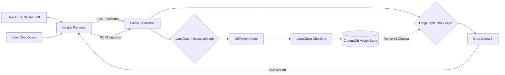

<div align="center">
  
# ⚡ GitWise AI

**An Agentic RAG Platform for GitHub Repositories**

[](https://nextjs.org/)
[](https://fastapi.tiangolo.com/)
[](https://langchain-ai.github.io/langgraph/)
[](https://groq.com/)
[](https://trychroma.com/)

</div>

<br/>

GitWise is a full-stack, AI-powered platform that allows developers to **chat with any public GitHub repository instantly**. By leveraging an Agentic Retrieval-Augmented Generation (RAG) architecture, it clones repositories, processes the codebase into vector embeddings locally, and provides real-time, context-aware answers to complex architecture and code-level questions.

## ✨ Key Features

- **Agentic Indexing Workflow**: Built with `LangGraph` StateGraphs to orchestrate recursive repository cloning, intelligent chunking, and vector database insertion.
- **Blazing Fast AI Responses**: Powered by **Groq** (Llama 3 8B) for ultra-low latency token generation.
- **Local Vector Embeddings**: Uses completely free, local `HuggingFaceEmbeddings` via SentenceTransformers, stored persistently in **ChromaDB**.
- **Real-Time Streaming**: Next.js frontend consumes Server-Sent Events (SSE) from the FastAPI backend to render markdown responses token-by-token.
- **Modern UI/UX**: Custom dark glassmorphism design system built from scratch with standard CSS and React hooks.

## 🏗️ Architecture



## 🚀 Live Demo
*(Insert your Vercel Link Here)*

---

## 💻 Local Setup & Installation

### 1. Clone the repository
```bash
git clone https://github.com/yourusername/gitwise-ai.git
cd gitwise-ai
```

### 2. Backend Setup (FastAPI)
```bash
cd backend
python -m venv venv
source venv/bin/activate
pip install -r requirements.txt
```
Create a `.env` file in the root directory and add your Groq API Key:
```env
GROQ_API_KEY=your_api_key_here
```
Run the backend:
```bash
python main.py
# API runs on http://localhost:8001
```

### 3. Frontend Setup (Next.js)
```bash
cd frontend
npm install
npm run dev
# Frontend runs on http://localhost:3000
```

---

## 🛠️ Technology Stack
- **Frontend**: Next.js 14, React, TypeScript, Vanilla CSS
- **Backend**: Python, FastAPI, Uvicorn, Server-Sent Events (SSE)
- **AI / LLMOps**: LangChain, LangGraph, Groq API, HuggingFace (`all-MiniLM-L6-v2`)
- **Database**: ChromaDB (Local persistent vector store)
- **Deployment**: Vercel (Frontend), Render / Hugging Face Spaces (Backend)

<br/>
<div align="center">
  <i>Built to showcase modern LLM engineering and full-stack development capabilities.</i>
</div>
